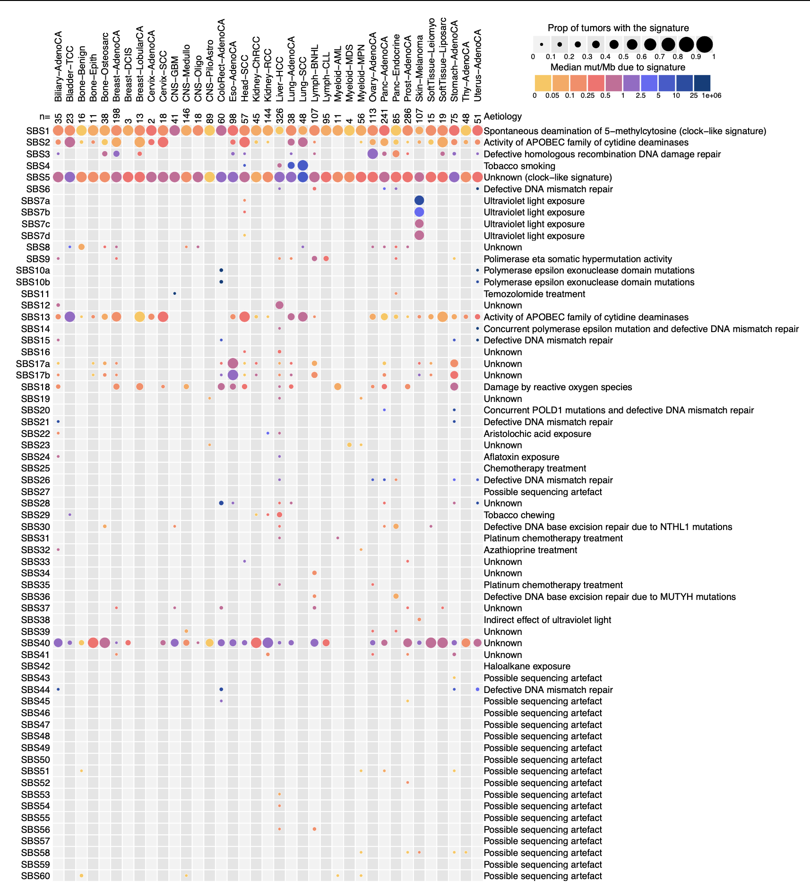

# tableExtra

The goal of tableExtra is to reproduce the figure 3 of the paper PCAWG Mutational Signatures Working Group et al. **The
repertoire of mutational signatures in human cancer**. *Nature* 2020.
[doi](https://www.nature.com/articles/s41586-020-1943-3).

## Example: PCAWG Fig 3 SBS signatures

