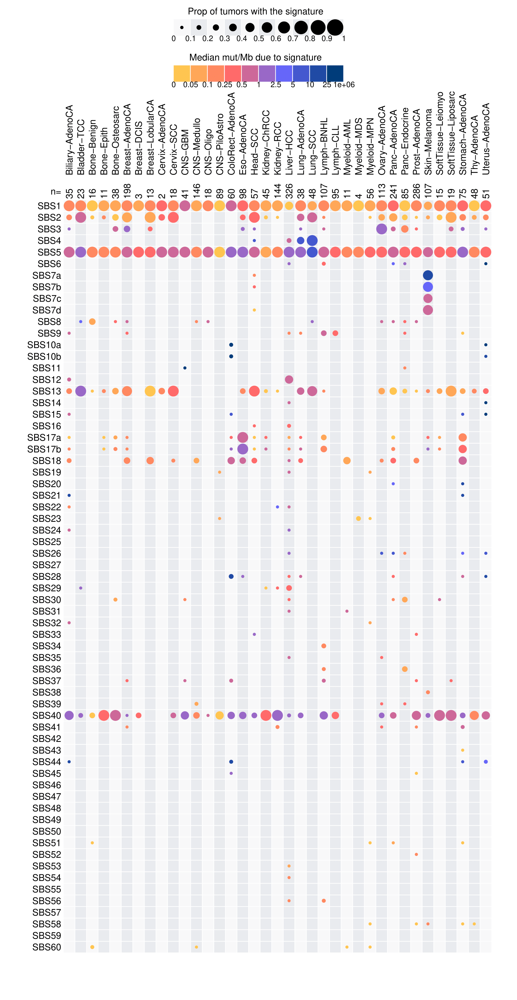

# tableExtra

[](https://opensource.org/licenses/Apache-2.0)
[](https://app.codecov.io/gh/ypradat/tableExtra)

tableExtra is an R package that allows you to produce heatmaps with double information encoded in the shapes colors and
sizes. The goal of tableExtra is to be able to produce figures like the figure 3 of the paper PCAWG Mutational
Signatures Working Group et al. **The repertoire of mutational signatures in human cancer**. *Nature* 2020.
[doi](https://www.nature.com/articles/s41586-020-1943-3).

## Installation

You can install the development version of tableExtra from [GitHub](https://github.com/) with:

``` r
# install.packages("devtools")
devtools::install_github("ypradat/tableExtra")
```

## Example code

This is a basic example which shows you how to reproduce the first figure displayed in `Example figures` section.

``` r
library(dplyr)
library(tableExtra)
library(tibble)

load(system.file("testdata", "pcawg_counts.rda", package="tableExtra"))
load(system.file("testdata", "sbs_aetiologies.rda", package="tableExtra"))

pcawg_plot_data <- function(){
  scale_breaks <- seq(from=0, to=1, by=0.1)
  color_palette <- c("#ffc651", "#ffa759", "#ff8962", "#ff6b6b", "#cc6999", "#9968c8", 
                     "#6767f8", "#4459ce", "#224ba5","#013d7c")
  color_breaks <- c(0, 0.05, 0.1, 0.25, 0.5, 1, 2.5, 5, 10, 25, 1e6)
  color_bg <- c("#f8f9fa", "#e9ecef")

  theme <- ttheme_awesome(base_size=12,
                          rep_mode="col",
                          core_size=5, 
                          scale_breaks=scale_breaks,
                          color_palette=color_palette, 
                          color_breaks=color_breaks, 
                          core=list(bg_params=list(fill=color_bg)))

  # define dscale and cols_more from PCAWG data
  dscale <- pcawg_counts %>%
    group_by(Cancer.Types) %>%
    mutate(n=n()) %>%
    summarize_at(vars(-Sample.Names, -Accuracy), ~sum(.x>0)) %>%
    mutate_at(vars(-Cancer.Types,-n), ~./n)

  cols_more <- list("n="=dscale$n)
  dscale$n <- NULL
  dscale <- column_to_rownames(.data=dscale, var="Cancer.Types")
  dscale <- t(as.matrix(dscale))
  
  # define dcolor and rows_more from PCAWG data
  mask <- sbs_aetiologies$Signature %in% rownames(dscale)
  rows_more <- list("Aetiology"=sbs_aetiologies[mask, "Aetiology"])

  dcolor <- pcawg_counts %>%
    group_by(Cancer.Types) %>%
    summarize_at(vars(-Sample.Names, -Accuracy), ~median(.[.!=0]*1e6/3.2e9)) %>%
    replace(is.na(.),0)

  dcolor <- column_to_rownames(.data=dcolor, var="Cancer.Types")
  dcolor <- t(as.matrix(dcolor))

  list(dscale=dscale, dcolor=dcolor, cols_more=cols_more, rows_more=rows_more, theme=theme)
}

# tables needed for the plot and graphical parameters in `theme`
plot_data <- pcawg_plot_data()
output <- "table_extra_pcawg.pdf"

# draw
draw_table_extra(dscale=plot_data$dscale, theme=plot_data$theme, output=output,
                 dcolor=plot_data$dcolor, cols_more=plot_data$cols_more,
                 rows_more=plot_data$rows_more,
                 dscale_title_legend="Prop of tumors with the signature",
                 dcolor_title_legend="Median mut/Mb due to signature")
```

## Example figures

The figures below were produced using this package.

### PCAWG Fig 3 SBS signatures


### PCAWG Fig 3 SBS signatures variants

The figure may be customized by addition/removal of rows/columns descriptors and position of the legend.

#### No legend, no rows more


#### Legend top left, no rows more


#### Legend top right, no rows more


#### Legend center, no rows more


